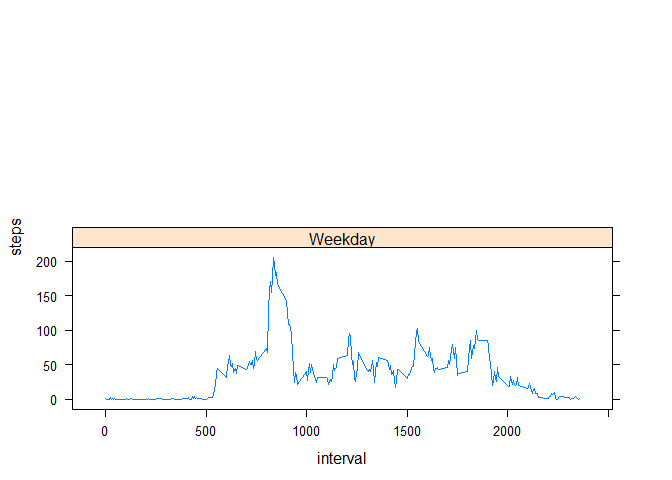

# RepData_PeerAssessment1
PuNa  
Sunday, Feburary 8, 2015  

## Loading and preprocessing the data


```r
data <- read.csv("activity.csv")
data$date <- as.Date(data$date)
data2 <- data[which(data$steps!="NA"), ]
```

## What is mean total number of steps taken per day?


```r
library(plyr)
daily_steps <- ddply(data2, .(date), summarise, steps=sum(steps))
hist(daily_steps$steps, xlab="Steps per Day", ylab="Frequency", main="Daily Steps")
```

 

```r
# Mean and median total number of steps taken per day

mean(daily_steps$steps)
```

```
## [1] 10766.19
```

```r
median(daily_steps$steps)
```

```
## [1] 10765
```

## What is the average daily activity pattern?

```r
average_date <- ddply(data2, .(interval), summarise, steps=mean(steps))
plot(average_date$interval, average_date$steps, type="l", xlab="5-minute Interval", 
ylab="Average Steps", main="Average Daily Activity")
```

 

```r
# Which 5-minute interval, on average across all the days in the dataset, contains the maximum number of steps?
average_date[average_date$steps==max(average_date$steps),]
```

```
##     interval    steps
## 104      835 206.1698
```

```r
colnames(average_date)[2] <- "intervalAvg"
```

## Imputing missing values

```r
# Total number of missing values
sum(is.na(data$steps))
```

```
## [1] 2304
```

```r
# Imputing NA's with average on 5-min interval
merged <- arrange(join(data, average_date), interval)
```

```
## Joining by: interval
```

```r
# New dataset 
merged$steps[is.na(merged$steps)] <- merged$intervalAvg[is.na(merged$steps)]
# Plot the histogram
new_daily_steps <- ddply(merged, .(date), summarise, steps=sum(steps))
hist(new_daily_steps$steps, main="Number of Steps", 
     xlab="steps taken each day", ylab="Frequency")
```

 

```r
# mean and median total number of steps taken per day don't change significantly
mean(new_daily_steps$steps)
```

```
## [1] 10766.19
```

```r
median(new_daily_steps$steps)
```

```
## [1] 10766.19
```

```r
daily_steps_1 <- sum(data2$steps)
daily_steps_2 <- sum(merged$steps)
diff <- daily_steps_2 - daily_steps_1 []
```

- Do these values differ from the estimates from the first part of the assignment?
Not really.
- What is the impact of imputing missing data on the estimates of the total daily number of steps?
The histograms seemed to be alike, the frequency incresed.

## Are there differences in activity patterns between weekdays and weekends?


```r
library(lattice)
weekdays <- weekdays(as.Date(merged$date))
data_weekdays <- transform(merged, day=weekdays)
data_weekdays$wk <- ifelse(data_weekdays$day %in% c("Saturday", "Sunday"),"Weekend", "Weekday")
average_week <- ddply(data_weekdays, .(interval, wk), summarise, steps=mean(steps))

xyplot(steps ~ interval | wk, data = average_week, layout = c(1, 2), type="l")
```

 
